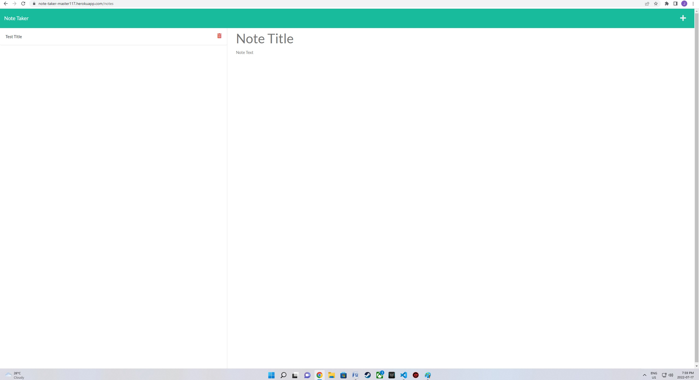
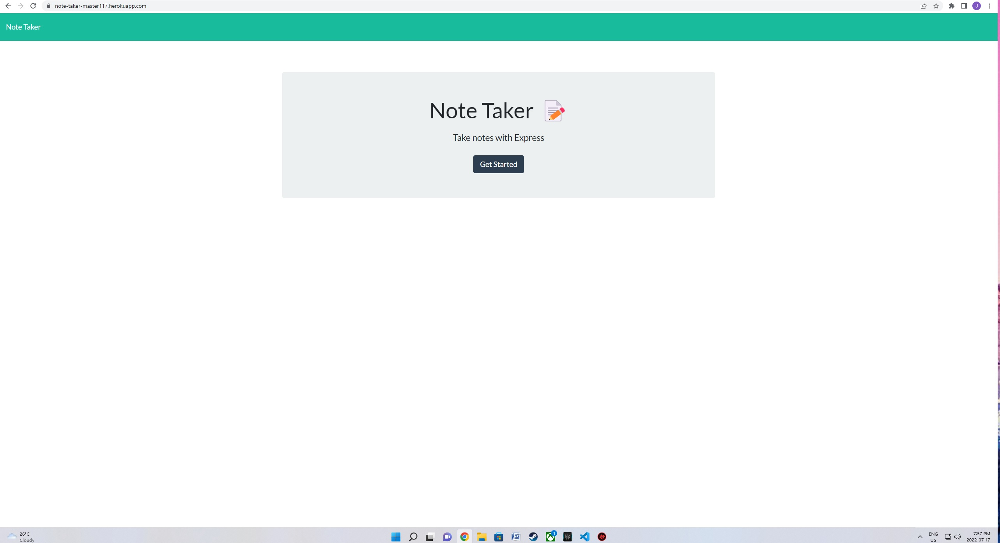

# Note Taker

### Express.js Challenge: Note Taker

## Project Description
This project allows the user to take notes by using Express.js back end and saves and retreives notes from a JSON filew

## Installation
You can clone the project from GitHub by copying either HTTPS or SSH link or by downloading the project as a zip file. Run npm start to connect and go to localhost:3001 in your browser

## Usage
To run locally, run npm start to connect and go to localhost:3001 in your browser alternatively you can visit the deployed heroku link here https://note-taker-master-117.herokuapp.com/

## Deployed Website
https://note-taker-master-117.herokuapp.com/

## Screenshot
![Screenshot]

  

## Contribution
Made by Joe Chaaya